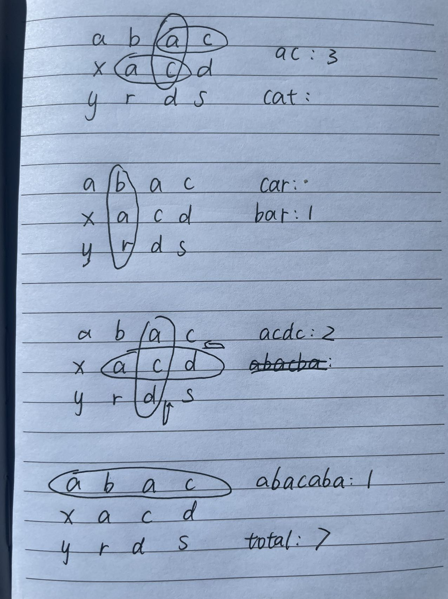

# String Search in Matrix
You are given a matrix of characters and an array of distinct strings words. Your task is to implement a simplified string search by determining the number of times in which strings from words can be found in the matrix under the following constraints:

- A string is found when it can be formed by
combining characters along some path in the matrix.
- A path may start at any cell, and initially must go from left to right or from top to bottom.
- All paths are allowed to change direction once to go in the opposite direction (i.e., from left -> right to right -> left, or from top -> bottom to bottom -> top).

Review the examples below for details.

Note: You are not expected to provide the most optimal solution, but a solution with time complexity not worse than o (matrix. length * matrix[0].length * words.length * (max (words [i].length)) will fit within the execution time limit.

### Example
- For
matrix = [["a", "b", "a", "c"],
["x", "a", "c", "d"],
["y", "r", "d", "s"]]
and words = ["ac", "cat", "car", "bar",
"acdc", "abacaba"], the output should be
solution (matrix, words) = 7

### Solution
```Python
# Analysis for time complexity:
# for each word: width * height * word.length
```